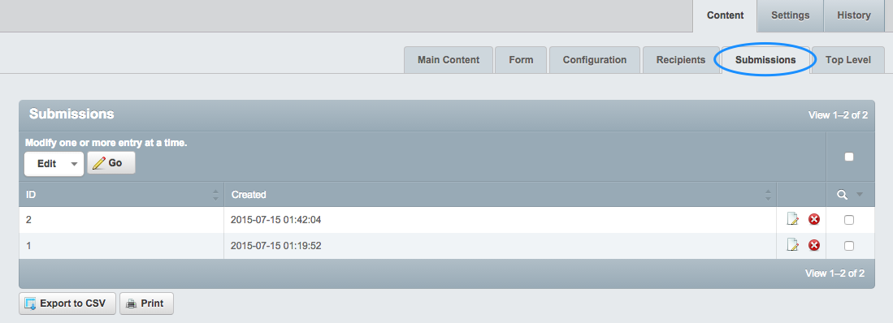
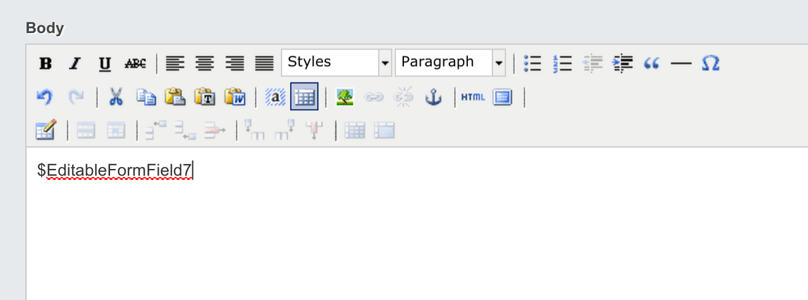

# Form submissions

## Viewing form submissions in the CMS

To view form submissions navigate to the 'Submissions' tab. You can click any of the listed submissions to view the content of each submission.

## Setting up automated emails for submissions

It is possible to set up automated emails upon each form submission, to do this navigate to the "Recipients" tab and click "Add Email Recipient".

You will be prompted with a form where you can fill in the details of the email.

### Using form fields in submission emails

Each form field has a unique merge field located under the field's options.

Simply insert the merge field into the email content, and the field's value will be displayed, when the email is sent.

### Email details

#### Email Subject

The subject of the email, you can either type a custom subject here or select a field from the form to use as the email subject.

#### Send email to

This is the recipient's address where the email will be sent.

#### Send email from

This shows where the email was sent from, and will most likely need to be an email address on the same domain as your site. For example If your website is yoursite.com, the email address for this field should be something@yoursite.com.

#### Email for reply to

This will be the address which the email recipient will be able to 'reply' to.

#### Email content

In this field you can add a custom message to add to the email

#### Hide form data from email?

You can check this if you do not wish for the email recipient to see the form submission's data in the email.

#### Send email as plain text?

You can check this if you want to remove all of the HTML from the email, this means the email
will have no custom styling and the recipient will only see the plain text.

If `Send email as plain text?` is unselected, several additional options for HTML editing are displayed.

If sending as HTML, there is the option to preview the HTML that is sent in the editor. Additionally, a HTML
template can be selected to provide a standard formatted email to contain the editable HTML content.

The list of available templates can be controlled by specifying the folder for these template files in yaml config.

	:::yaml
	UserDefinedForm:
	  email_template_directory: mysite/templates/useremails/

### Custom Rules

In this section you can determine whether to send the email to the recipient based on the data in the form submission.

#### Send conditions

This decides whether to send the email based on two options

1. *All* conditions are true (Every single custom rule must be met in order to send the email)
2. *Any* conditions are true (At least one of the custom rules must be met in order to send the email)

#### Adding a custom rule

* Click 'Add' to add a custom sending rule.
* Select the field which you want the custom rule to apply to
* Select the condition the field must follow
* enter for the condition (the 'is blank' and 'is not blank' conditions do not require any text)

